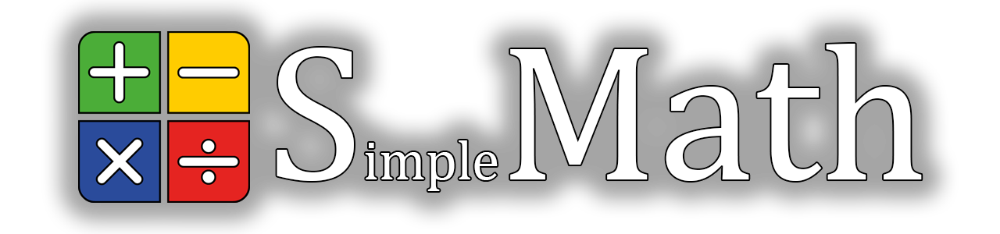

# 

**SMath** is a C++14 header-only math library focused on 2D and 3D graphics.  
It provides vector, matrix, and quaternion math, written with simplicity and control in mind.

## Table of Contents:

- [Overview](#overview)
- [Installation](#installation)
- [Usage](#usage)
- [Requirements](#requirements)
- [License](#license)
- [Acknowledgments](#acknowledgments)

## Overview

**SMath** is a modular math library intended primarily for real-time graphics and 3D applications.  
It is built around plain C++14, with a focus on clean types, inlined operations, and predictable behavior.

All math is based on `float`, as commonly used in GPU workflows.  
There are no templates or dynamic allocations.

Trigonometric functions in the library are implemented as wrappers around the standard library.  
This allows replacing the backend implementation globally if a different or faster version is needed.

The library is written for personal use in a 3D model viewer, but may be useful in other projects as well.

Types are plain structs; all operations live in free functions.

## Installation 

No build step is required. Just add the `Include/` directory to your compiler's include path and include the main header in your source file:

```cpp
#include <SMath/SMath.hpp>
```

## Usage

```cpp
#include <SMath/SMath.hpp>

int main() {
    smath::Vector3 a{1.0f, 2.0f, 3.0f};
    smath::Vector3 b{4.0f, 5.0f, 6.0f};

    auto sum = a + b;
    auto cross = smath::Cross(a, b);
    auto normalized = smath::Normalize(sum);
}
```
Short aliases (`Vec2`, `Vec3`, `Mat4`, etc.) are provided as alternatives to full type names.

## Requirements

- C++14-compliant compiler
- No third-party dependencies
- Cross-platform (standard C++ only)

## License

SMath is licensed under the MIT License, see [LICENSE.txt](LICENSE.txt) for more information.

## Acknowledgments

This library was influenced by:

- [GLM](https://github.com/g-truc/glm)
- [DirectXMath](https://github.com/microsoft/DirectXMath)

All code is written from scratch with its own structure and goals.